### 1.知识图谱历史发展、技术简介及应用案例

#### 1.1 发展历程

##### 1960年语义网络  1980年本体论  1989年Web  1998年语义网 2006年链接数据 2012年知识图谱


```python
from IPython.display import Image
Image('KG-develop.png')
```


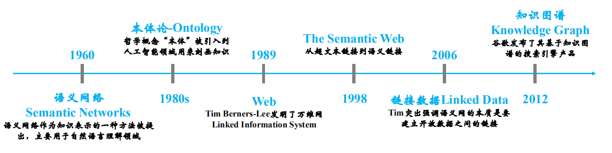


##### 知识图谱理念：Things , Not Strings !
##### 现有的较大的知识库有：


```python
from IPython.display import Image
Image('kgs.png')
```


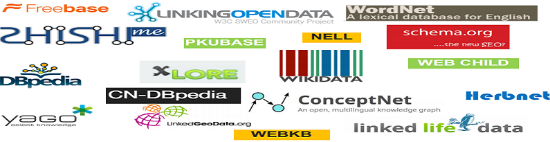


##### Linked Open Data网址：https://lod-cloud.net/


```python
from IPython.display import Image
Image('linkedopendata.jpg')
```


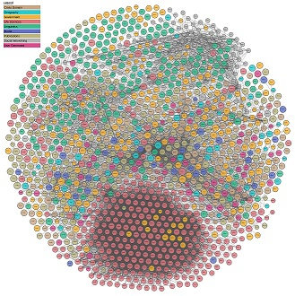


#### 1.2 技术简介

##### a.知识表示  : RDF/OWL
##### b.知识抽取  :结构化/半结构化/非结构化
##### c.知识存储  :关系型数据库/非关系型数据库/图数据库
##### d.知识融合  :知识链接/去重/去歧义
##### e.知识推理  :isMother(A,B)--->isSon(B,A)
##### f.知识众包  :百度百科/Wiki百科
##### g.语义搜索和知识  :搜索意图的理解--->查询知识库--->知识卡片


```python
from IPython.display import Image
Image('kg技术.png')
```


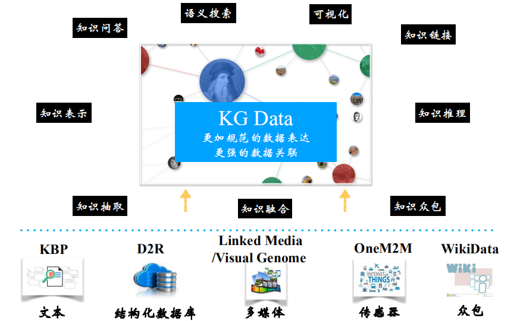


#### 1.3应用领域

##### 医药  电商 企业 金融 博物馆 媒体 用户画像


```python
from IPython.display import Image
Image('知识图谱的应用.png')
```


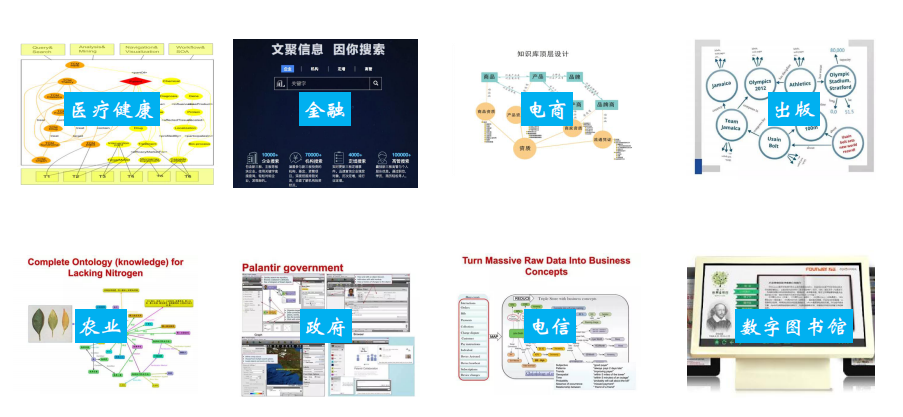


### 2.知识图谱研究方向

#### 2.1 知识表示 

##### 有规则才能有序，有序才能建立大规模的系统。知识表示实际上是定义的系列规则，用于约束和规范知识的记录并方便知识的推理和存储


```python
from IPython.display import Image
Image('知识表示.png')
```


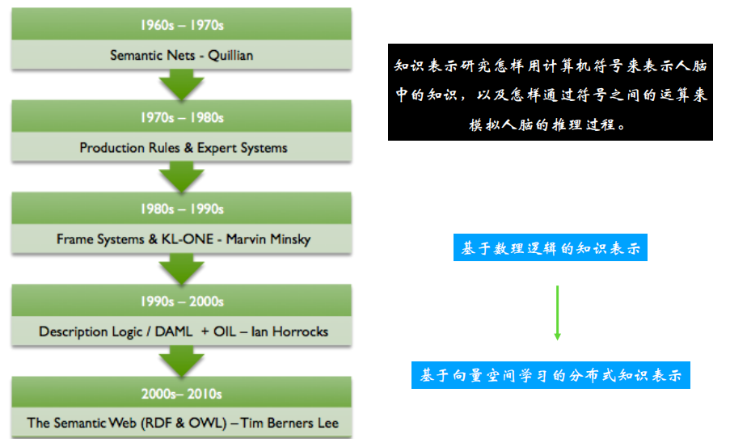


##### RDF采用三元组的形式对数据进行存储，OWL是构建筑RDF之上的本体描述语言，它的优势在于拥有更加丰富的预定义词汇

###### 2.1.1 知识建模

###### 在知识描述框架下对知识进行建模，也叫本体设计。常用的本体建模工具为protege,下载地址：https://protege.stanford.edu/download/protege/
###### 本体建模类似于ER表设计，主要用于指导数据的抓取、存储、推理
###### 下面是使用protege创建的电影、电影类别、电影演员的本体设计图


```python
from IPython.display import Image
Image('本体设计.png')
```


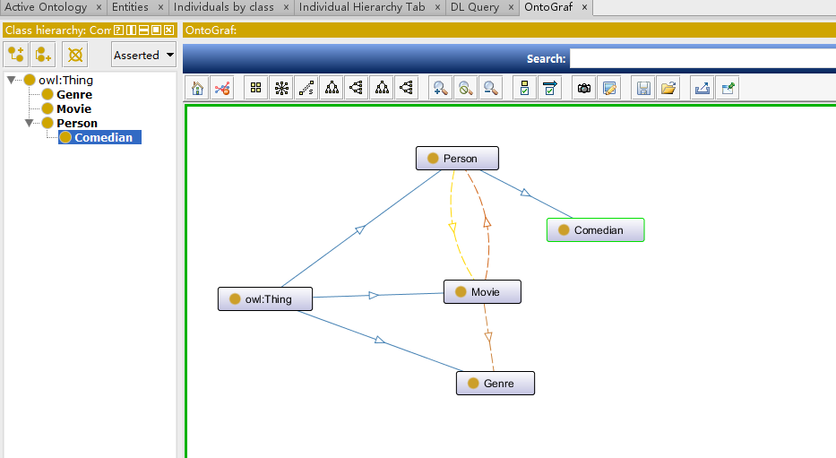


##### RDF的标准查询语言为SPARQL，语法和SQL语法类似
##### 下面演示一下SparQL基本使用

###### a.通过docker 下载jena-fuseki docker search docker.io/stain/jena-fuseki
###### b.运行jena-fuseki启动容器：docker run -d -p 3030:3030 -e 'ADMIN_PASSWORD=jena' --name jena docker.io/stain/jena-fuseki
###### c.通过网页访问 http://192.168.0.224:3030 初始账号为admin  jena 


```python
from IPython.display import Image
Image('sparql.png')
```


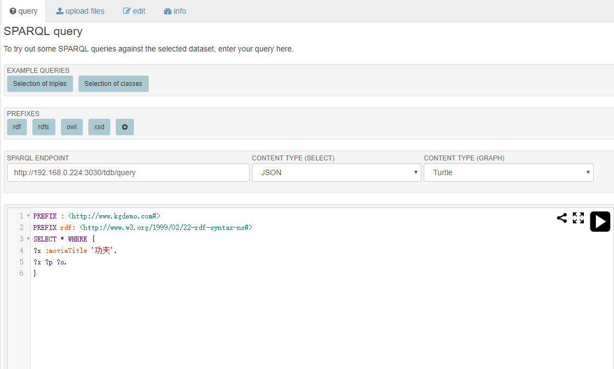


```python
from IPython.display import Image
Image('功夫.png')
```


#### 2.2 知识抽取

##### 从结构化、半结构化、非结构化数据中抽取Entity、关系、事件等的过程


```python
from IPython.display import Image
Image('不同结构知识抽取.png')
```


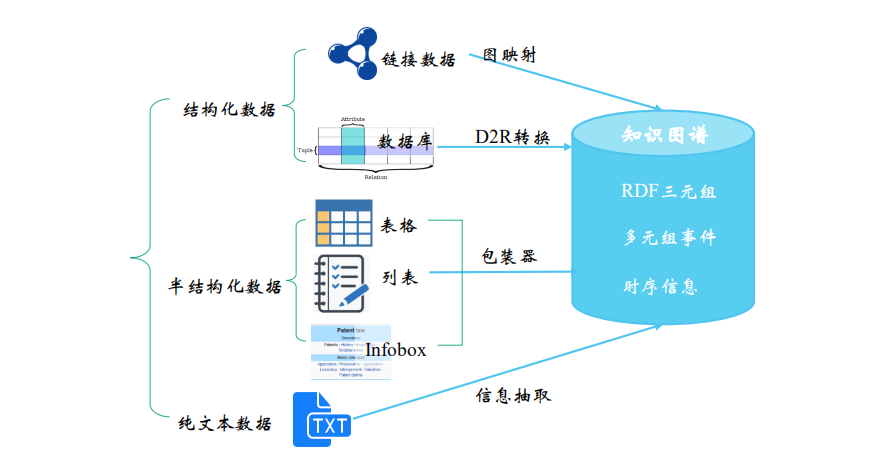


##### 知识抽取方法有：1.正则表达式匹配抽取   2.BootStrap算法的模板匹配算法  3.利用NLP中的POS、NER或者词与词之间的距离来进行提取  4.PRA图推理算法 5.TransE向量模型
##### 关系抽取工具：deepdive 下载地址： https://pan.baidu.com/s/1slLpYVz
##### 原理：采用stanfordNLP先分词，然后创建词特征，用弱监督学习的方式学习Pattern，最终找出实体之间的关联


```python
from IPython.display import Image
Image('deepdive关系挖掘.png')
```


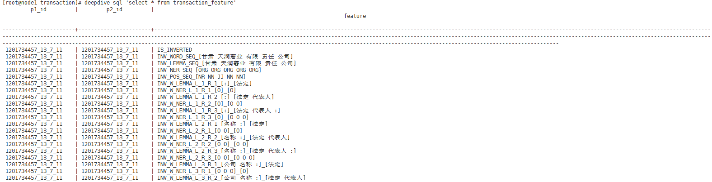


#### 2.3 知识存储

##### 知识的存储比单纯的数据存储更复杂，需要考虑更多的数据结构和索引，以便于查询和推理的优化。
##### 常见的存储方式有关系型数据库mysql/oracle/postgresql等，图数据库neo4j/gstore/rdf4j等，非关系型数据库mongodb/hbase等

##### 下面是最常用图数据库neo4j安装及简单实用

##### 1.基于docker 安装neo4j :    docker pull neo4j
##### 2.启动容器       docker run -d -p 7473-7474:7473-7474 -p 7687:7687 --name neo4j neo4j
##### 3.访问neo4j     http://192.168.0.224:7474/browser/


```python
from IPython.display import Image
Image('neo4j.png')
```


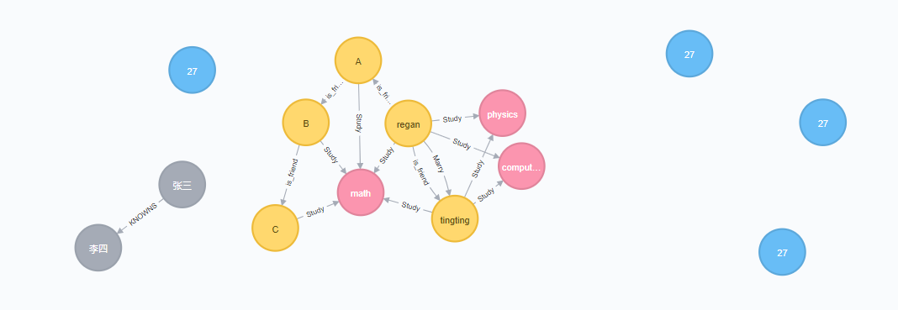


#### 2.4 知识融合

##### 知识融合还有很多叫法：数据链接、记录链接、实体消歧、知识融合、实体对其等叫法。
##### 它的主要工作是：在不同知识库中找出同一个实体的描述记录并进行整合，形成更加全面的实体信息


```python
from IPython.display import Image
Image('知识融合.png')
```


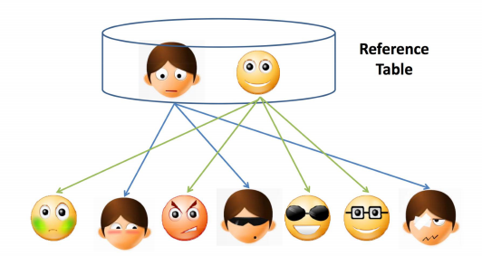


##### 知识融合工具：dedupe  http://openkg.cn/tool/dedupe
##### 融合原理：对所有记录进行聚类和分块，在类簇中两两进行相似性比较，超过阈值的则认为是相等的实体，从而进行链接。
##### Limes http://openkg.cn/tool/limes
##### 原理:基于弱监督学习算法，采用自定义距离计算记录之间的相似性

#### 2.5 知识推理

##### 推理是指基于知识库中的事实，推理出存在的其它事实的过程，例如：姚明的女儿的妈妈的老公？


```python
from IPython.display import Image
Image('知识推理.png')
```


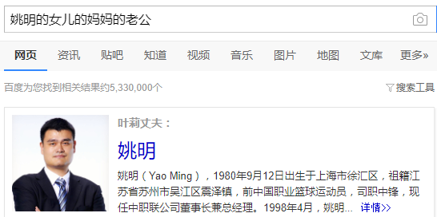


##### 推理常用方法：1.基于描述逻辑的推理 2.基于规则挖掘的推理 3.基于概率逻辑的推理 4.基于表示学习的推理等
##### 工具：1.drools规则引擎  2.jena实现了至少3中规则推理机

##### 规则推理项目：


#### 2.6 知识众包

##### 通过问答的形式让拥有知识的浏览者填空。常见的有百度百科、维基百科等

#### 2.7 语义搜索和知识问答

##### 通用步骤为：
##### 1.通过NLP技术理解用户意图 
##### 2.将用户意图转换为计算机能理解的表示如：a.基于符号问句的表示 b.基于问题模板的表示 c.基于子图的语义表示 d.基于分布式的语义表示 
##### 3.用计算机“理解”到的表示查询KG知识图谱 4.结果包装


```python
from IPython.display import Image
Image('语义搜索和知识问答.png')
```


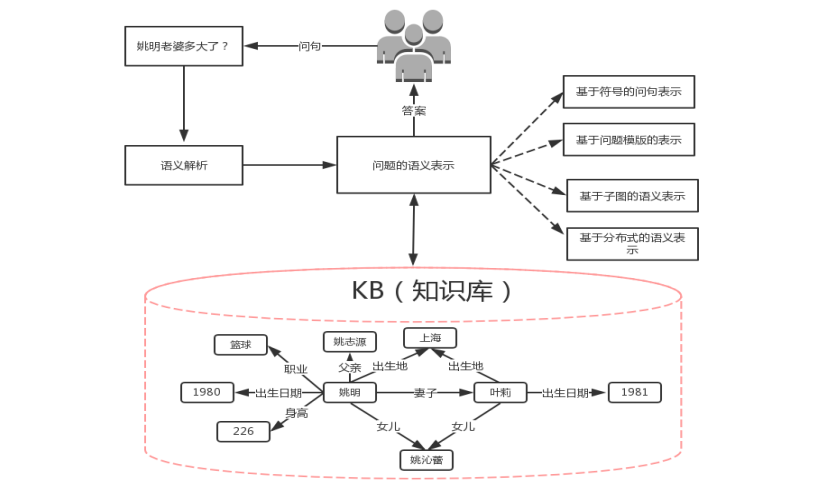


### 3.知识图谱应用Demo

##### 基于知识库的和REFO对象正则的模板匹配问答系统。
##### jieba分词，REFO对象正则匹配模板，Jena作为存储，SparQLWrapper做sparql查询。


```python
from IPython.display import Image
Image('REFO-KGDemo.png')
```


